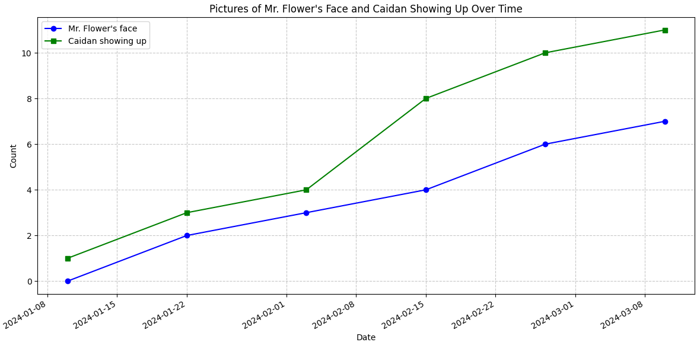

[](https://classroom.github.com/open-in-codespaces?assignment_repo_id=18859761)
# Axis of Awesome


## Project Overview

This project visualizes the correlation between two important classroom metrics: "Mr. Flower's face in the classroom" and "Caidan showing up." The data analysis reveals interesting patterns in how these two phenomena relate over time from January to March 2024.

## Description

The Python script generates a time-series visualization that tracks and compares:
- The increasing presence of Mr. Flower's face in the classroom
- The frequency of Caidan's appearances

As the visualization demonstrates, there appears to be a positive correlation between these two events, suggesting an intriguing classroom dynamic worthy of further investigation.

## Installation Requirements

To run this analysis, you need:

```bash
pip install pandas matplotlib numpy
```
## Usage

Run the script to generate the visualization:

```bash
python script.py
```

## Features

- Correlation Analysis: Visualizes the relationship between Mr. Flower's face appearances and Caidan showing up
- Time-Based Tracking: Follows both metrics from January 10th to March 10th, 2024
- Visual Differentiation: Uses blue circles for Mr. Flower's face count and green squares for Caidan's attendance

## Data Insights

The data reveals that as the number of Mr. Flower's face appearances increases, Caidan's attendance also rises. Whether this represents causation or merely correlation remains an open question for classroom researchers.